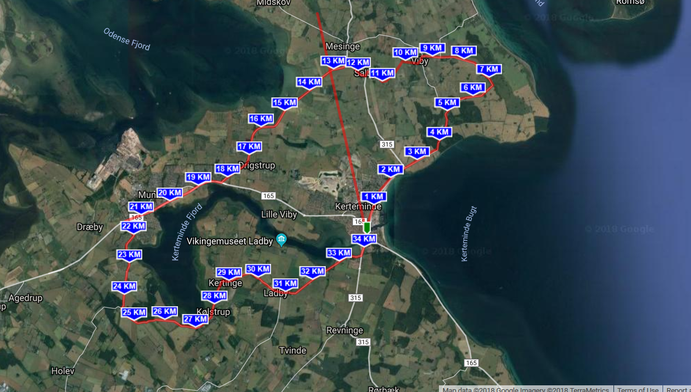

```{r setup, include = FALSE}
knitr::opts_chunk$set(echo = FALSE)

library(NHANES)
library(tidyverse)

source(here::here("R/version-control-session.R"))
```
## Introduction

In this experiment we collected some data and all went **extremely** well.

Explaining what *this* document is about - what is going on. Maybe even before I start analysing data.

If I want something squared(super script): kg/m^2^

If I want something subscript: H~2~O

If I want to do bullet points

- item **1**
- item 2
- item 3
- item 4
There must be a line break before and after a new sentence or bullet list, otherwise R think that it is a part of the previous paragraph.

If I want to see a draft of my R Markdown in the global environment, I go into Tools -> Global Options --> R Markdown --> Viewer plane. If I instead want to have a pop up window I change the Viewer Plane to 'Window'.

1. first step
2. second step

To make a 'block quote' (if I want to make something pop out, but the teachers very rarely use it)

To make a footnote I have to do the following:

This is a footnote[^1]
This will be footnote number 2 yeah[^2]
It is a bit annoying that you have to keep track of the footnote number[^3] yourself.

Write your footnotes in the end of each section. Then it is easier to keep travk of the footnotes and they will still be in the end of the document.

[^1]: This is the text of footnote number 1
[^2]: This is the second footnote
[^3]: This is the third footnote

## Methods

This is the amazing methods we used.



The two dots before the pathway and picture name means that R Markdown has to go two 'folders' up and look for the picture. Since this is R Markdown I cannot use 'here::here' as when I am writing a script. Indstead use dots.

This is an example of a link

[This is the source to amazing information](http://www.google.com)

The principle for inserting a image and inserting a link is the same, but there is just not a '!' for interting links but there are for pictures.

Normally, you should use a function called table to insert a table. You do not write everthyng by hand, but it is possible.

|    | Fun | Source |
|:-- | -----: | -----: |
|**Happy** | 1234 | 5678 |
|**Sad** | 5648 | 9852 |

Now I want to include some means of the experiment. To do this, click 'insert (green bottom) and choose 'R' and then I get the block of R code:
```{r summary-iris}
# This is a comment which will be ignored when I run the code
summary(iris)

summary(mtcars)
```


```{r bmi-plot, fig.cap="Add your figure title here.", fig.height=8, fig.width=8, echo=FALSE}
ggplot(NHANES, aes(x = Height, fill = Gender)) +
    geom_density(alpha = 0.4) +
    scale_fill_brewer(type = "qual", palette = "Dark2") +
    theme_minimal() +
    theme(legend.position = c(0.2, 0.85))
```


```{r mean-bmi-table, echo=FALSE}
library(knitr)
NHANES %>%
    select(SurveyYr, BMI, Diabetes) %>%
    group_by(SurveyYr, Diabetes) %>%
    summarise(MeanBMI = mean(BMI, na.rm = TRUE)) %>%
    spread(SurveyYr, MeanBMI) %>%
    kable(caption = "Table caption here")
```


 
# Standard R Markdown text

This is an R Markdown document. Markdown is a simple formatting syntax for authoring HTML, PDF, and MS Word documents. For more details on using R Markdown see <http://rmarkdown.rstudio.com>.

When you click the **Knit** button a document will be generated that includes both content as well as the output of any embedded R code chunks within the document. You can embed an R code chunk like this:

```{r cars}
summary(cars)
```

## Including Plots

You can also embed plots, for example:

```{r pressure, echo=FALSE}
plot(pressure)
```

Note that the `echo = FALSE` parameter was added to the code chunk to prevent printing of the R code that generated the plot.
